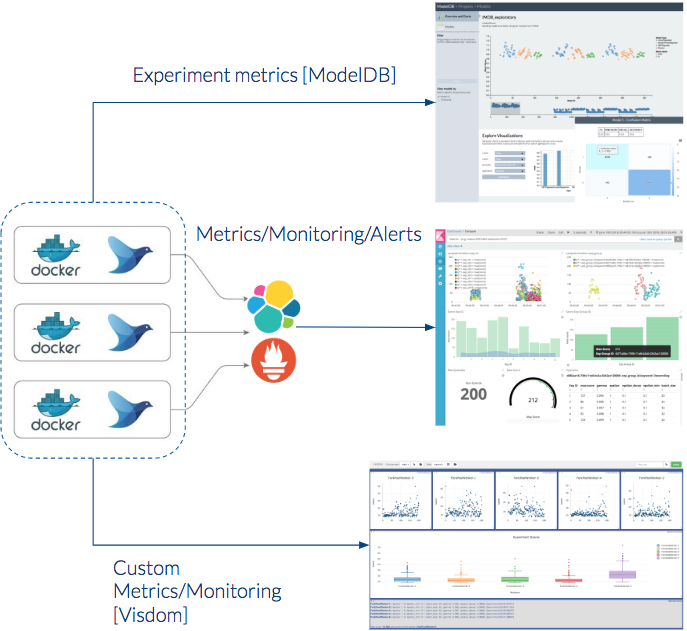

Cartpole RL Remote
==================

.. image:: https://circleci.com/gh/hypnosapos/cartpole-rl-remote/tree/master.svg?style=svg
   :target: https://circleci.com/gh/hypnosapos/cartpole-rl-remote/tree/master
   :alt: Build Status
.. image:: https://img.shields.io/pypi/v/cartpole-rl-remote.svg?style=flat-square
   :target: https://pypi.org/project/cartpole-rl-remote
   :alt: Version
.. image:: https://img.shields.io/pypi/pyversions/cartpole-rl-remote.svg?style=flat-square
   :target: https://pypi.org/project/cartpole-rl-remote
   :alt: Python versions
.. image:: https://codecov.io/gh/hypnosapos/cartpole-rl-remote/branch/master/graph/badge.svg
   :target: https://codecov.io/gh/hypnosapos/cartpole-rl-remote
   :alt: Coverage
.. image:: https://app.fossa.io/api/projects/git%2Bgithub.com%2Fhypnosapos%2Fcartpole-rl-remote.svg?type=shield
   :target: https://app.fossa.io/projects/git%2Bgithub.com%2Fhypnosapos%2Fcartpole-rl-remote?ref=badge_shield
   :alt: License status

This project is intended to play with `CartPole <https://gym.openai.com/envs/CartPole-v0/>`_ game using Reinforcement Learning.

The model is divided basically in three parts: Neural network model, QLearning algorithm and application runner.

We want to show you a journey from custom model trainer to a productive platform based on open source (training/inference).

Requirements
============

Basic scenario (Station #1):

- Make (gcc)
- Docker (17+)
- Docker compose (version 17.06.+, compose file format 3.3)

Advanced scenarios (Station #2 and #3):

- kubernetes (1.8+)

Station #1: Custom trainer and metrics collection
=================================================

As with any other software development, machine learning code must follow the same best practices.
It's very important to have on mind that our code should be run on any environment, on my laptop or on any cloud.

First attempt was to train CartPole model with our own trainer by a multiprocessor python module,
by default it'll try to use one processor for each hyperparameter combination (model experiment).

As result of the training we'll get out an **h5** file with the trained model and all metrics about the training process.

Collecting metrics with visdom
------------------------------

We trust in logs, so all details of model training should be outlined using builtins log libraries, and then the instrumentation
may come from tools that manage these log lines. We've used as first approach a log handler for Visdom server in order to send metrics to an external site.

Using python virtual env
^^^^^^^^^^^^^^^^^^^^^^^^

Requirements:

- Python (3.5+)

To create a local virtual env for python, type::

   make venv

When this virtual env is activated, we can use the ``cartpole`` command client directly, type::

   cartpole --help

for more information about how to use it.

We have a couple of arguments to provide visdom configuration to send metrics: ``--metrics-engine`` and ``--metrics-config``.

The simplest way to train the model and collect metrics with visdom is next command::

   make train-dev

Change default values for hyperparameters in Makefile file if you wish another combination. Note that render mode is activated by default (``-r`` argument)
so many windows, one per experiment, will show the CartPole game in action while is training.

Visdom server must be ready at: http://localhost:8097

Using docker compose
^^^^^^^^^^^^^^^^^^^^

If you prefer use docker containers for everything launch this command::

   make train-docker-visdom

Using docker log drivers, EFK in action
---------------------------------------

Ok, it's possible to implement our metrics collector, but as we are using containers, couldn't we use docker log drivers to extract metrics from log lines?
Yes, of course.

We've created a fluentd conf file to specify the regex pattern of searched lines in logs, and fluentd will send metrics to elasticsearch,
finally visualizations of metricswill be available through kibana dashboard.

To run this stack type::

   make train-docker-efk

Kibana URL would be: http://localhost:5601. Set the text ``cartpole-*`` for the index pattern.
In **efk/kibana** directory you can find a kibana dashboard json file that you can import to view all graphics about cartpole model experiments.

Anybody could launch a docker compose with visdom and the EFK all-in-one by this command::

   make train-docker-visdom-efk

Station #2: Advanced training with Polyaxon
===========================================

Well, we have a simple model trainer with simple hyperparameter tuning implementation (something like a well known grid algorithm).
But we have too few hands on the code, and few weeks ago i discovered `polyaxon <http://polyaxon.com>`_.
It uses kubernetes as platform where all resources will be deployed.

The challenge now is try to create a polyaxon wrapper to take the CartPole model and train multiple experiments.

Under the directory **polyaxon** you can find all resources related to it.

Follow this command sequence to get a kubernetes cluster with all polyaxon components installed (we'll use GKE service)::

   export GCP_CREDENTIALS=/tmp/gcp.json
   export GCP_ZONE=europe-west1-b
   export GCP_PROJECT_ID=<my_project>
   export GKE_CLUSTER_NAME=cartpole
   export GITHUB_TOKEN=<githubtoken>
   make gke-bastion gke-create-cluster gke-tiller-helm gke-proxy gke-ui-login-skip

We'll use the default one node ZFS server as polyaxon docs shows us (feel free to change de volume driver)::

   make -C polyaxon gke-polyaxon-nfs
   make -C polyaxon gke-polyaxon-nfs-grafana

In

Install polyaxon components on kubernetes and configure the polyaxon client on gke-bastion container ::

   make -C polyaxon gke-polyaxon-preinstall gke-polyaxon-install gke-polyaxon-cartpole-init

Finally, let's deploy our experiments groups by this command::

   make  gke-polyaxon-cartpole

Kubernetes web console should be ready at: http://localhost:8001/ui

You can use the gke-bastion container as proxy for gcloud, kubectl or polyaxon commands directly, i.e::

   docker exec -it gke-bastion sh -c "kubectl get pods -w -n polyaxon"

Here you have some screen shots

.. image:: assets/polyaxon.png
   :alt: Polyaxon

Station #3: Model inference with Seldon
=======================================

The idea is to get trained models and deploy them within `Seldon <https://seldon.io>`_.
Install this python module to train or run the RL model under the wood.

Deploy Seldon
-------------

We're going to use the same kubernetes cluster, but you may to use another.

Deploy Seldon::

   make gke-seldon-install

Deploy CartPole within Seldon
-----------------------------

Deploy seldon graphs with the cartpole model with different implements (choose one value of: [model, abtest, router] for SELDON_MODEL_TYPE variable)::

   SELDON_MODEL_TYPE=router make gke-seldon-cartpole

Take a look at file **test/e2e/k8s-resources**  (DOING: helm chart to deploy much easier), the model is an PoC of the documented "Multi-armed bandit" by seldon team.

The idea is deploy a router component with three branches, two for "untrained" models ('cartpole-0' and 'cartpole-1', low score metric),
and one branch with a "max_score" (''cartpole-2', score metric 7000, the max value in training).
Default branch will be 0 ('cartpole-0') at the begining, as requests are received the router will be redirected traffic to branch 2 ('cartpole-2') according to the best scored model.

Run remote agent
----------------

You have to get external IP from svc/seldon-apiserver to set RUN_MODEL_IP variable.

In order to get model predictions launch this command in your shell::

  export RUN_MODEL_IP=35.205.148.146
  make run-dev

Model metrics in running mode will be collected on a `local visdom server <http://localhost:8059>`_.

Take a look at the grafana dashboard to view seldon metrics. Since *seldon-core-analytics* was installed with loadbalancer endpoint type, find the public ip to get access.

License
=======

.. image:: https://app.fossa.io/api/projects/git%2Bgithub.com%2Fhypnosapos%2Fcartpole-rl-remote.svg?type=large
   :target: https://app.fossa.io/projects/git%2Bgithub.com%2Fhypnosapos%2Fcartpole-rl-remote?ref=badge_large
   :alt: License Check

Authors
=======

- David Suarez   - `davsuacar <http://github.com/davsuacar>`_
- Enrique Garcia - `engapa <http://github.com/engapa>`_
- Leticia Garcia - `laetitiae <http://github.com/laetitiae>`_
