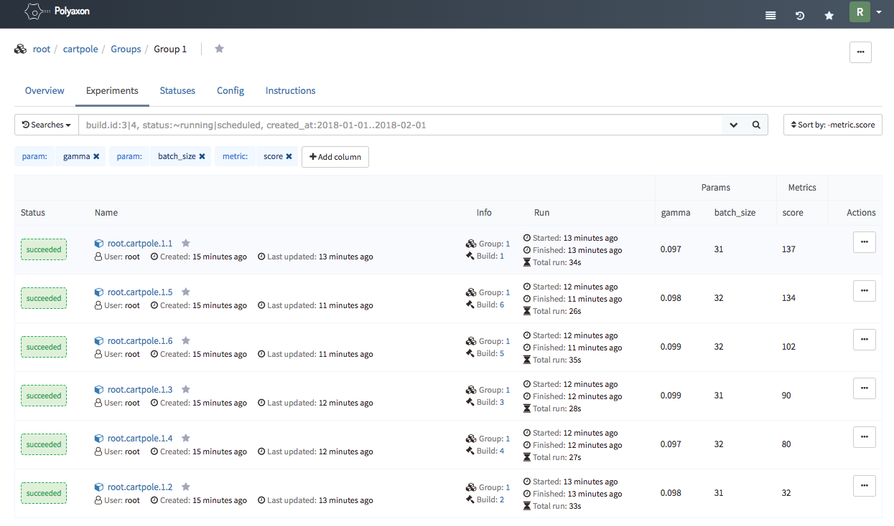
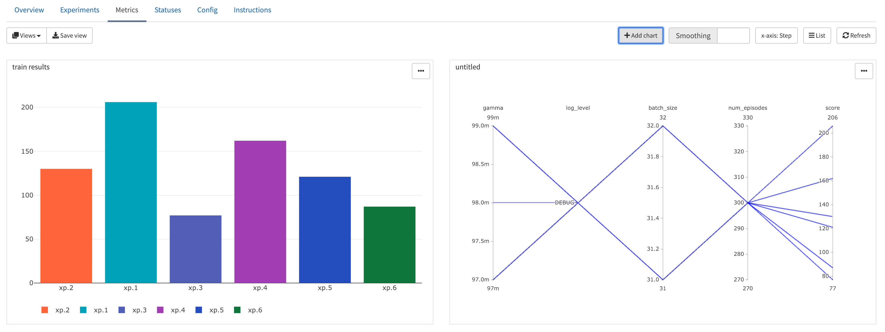
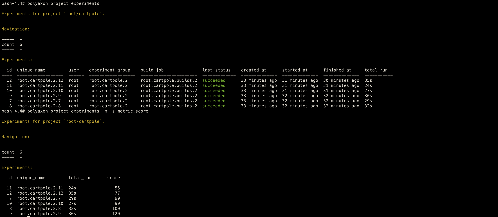
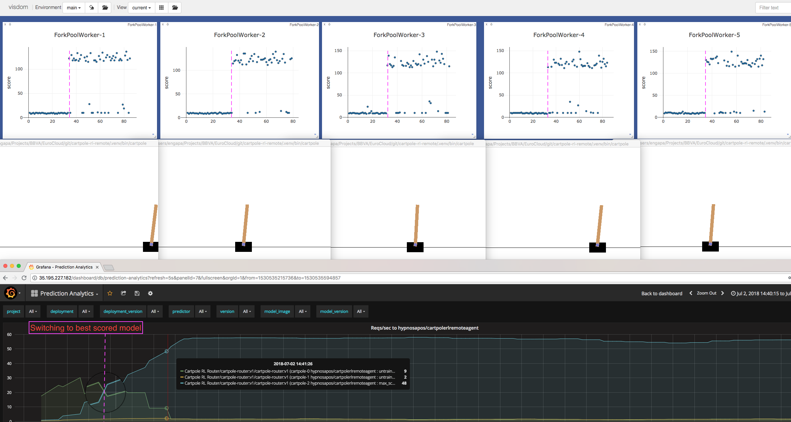

Cartpole RL Remote
==================

.. image:: https://circleci.com/gh/hypnosapos/cartpole-rl-remote/tree/master.svg?style=svg
   :target: https://circleci.com/gh/hypnosapos/cartpole-rl-remote/tree/master
   :alt: Build Status
.. image:: https://app.fossa.io/api/projects/git%2Bgithub.com%2Fhypnosapos%2Fcartpole-rl-remote.svg?type=shield
   :target: https://app.fossa.io/projects/git%2Bgithub.com%2Fhypnosapos%2Fcartpole-rl-remote?ref=badge_shield
   :alt: License status
.. image:: https://badges.frapsoft.com/os/v1/open-source.svg?v=103
   :alt: We love OpenSource

This project is intended to play with `CartPole <https://gym.openai.com/envs/CartPole-v0/>`_ game using Reinforcement Learning
and to know how we may train a different model experiments with enough observability (metrics/monitoring).

The model is divided basically in three parts: Neural network model, QLearning algorithm and application runner.

We want to show you a journey from custom training of models to a productive platform based on open source  (training/inference).

Requirements
============

Basic scenario (Station #1):

- Make (gcc)
- Docker (18+)
- Docker compose (version 17.06.+, compose file format 3.3)
- python 3.5 or 3.6

Advanced scenarios (Station #2 and #3):

- kubernetes (1.11+)
- polyaxon (0.4.3)
- seldon (0.2.6)

Station #1: Custom trainer and metrics collection
=================================================

As with any other software development, machine learning code must follow the same best practices, so
it's very important to have on mind that our code should be run on any environment, on my laptop or on any cloud (avoid vendor services, and ensuring portability anywhere).

First attempt was to train CartPole model with our own trainer by a multiprocessor python module,
by default it'll try to use one processor for each hyperparameter combination (model experiment).

*NOTE*: Yes, we could have tried tensorboard callbacks for background Keras model (or tensorflow models), but we wanna explore other ways too.

Collecting metrics with visdom
------------------------------

We trust in logs, so all details of model training should be outlined using builtins log libraries, and then the instrumentation
may come from tools that manage these log lines. We've used as first approach a log handler for Visdom server in order to send metrics to an external site.

Using python virtual env
^^^^^^^^^^^^^^^^^^^^^^^^

Requirements:

- Python (3.5+)

To create a local virtual env for python, type::

   make venv

When this virtual env is activated, we can use the ``cartpole`` command client directly::

   source .venv/bin/activate
   cartpole --help

We have a couple of arguments to setup metrics collection: ``--metrics-engine`` and ``--metrics-config``.

The simplest way to train the model and collect metrics with visdom (trough docker container) is next command ::

   make train-dev

Change default values for hyperparameters in Makefile file if you wish another combination.

*NOTE*: Render mode is activated with ``-r`` argument if you want to see CartPole game training.

Visdom server might be ready at: http://localhost:8097 with metrics and evaluation model results, this process gets out an **h5** file with the best trained model as well.

Using docker compose
^^^^^^^^^^^^^^^^^^^^

If you prefer use docker containers for everything launch this command (powered by docker-compose)::

   make train-docker-visdom

.. image:: assets/cartpole-visdom.gif
   :alt: Basic Scenario - Visdom

Using docker log drivers, EFK in action
---------------------------------------

Ok, it's possible to implement our own metrics collector, but as we are using containers, couldn't we use docker log drivers to extract metrics from log lines?
Yes, of course.

We've created a fluentd conf file (under directory **scaffold/efk/fluentd**) to specify the regex pattern of searched lines in logs, and fluentd will send metrics to elasticsearch,
finally visualizations of metrics will be available through kibana dashboard.

To run this stack type::

   make train-docker-efk

Kibana URL would be: http://localhost:5601. Set the text ``cartpole-*`` as the index pattern.
In **scaffold/efk/kibana** directory you can find a kibana dashboard json file that you can import to view all graphics about cartpole model experiments.

.. image:: assets/cartpole-efk.gif
   :alt: Basic Scenario - EFK

Using ModelDB as experiment repository
--------------------------------------

ModelDB is a MIT licensed project that let's track our model experiments pretty easy.

Check out typing::

   make train-docker-modeldb

Frontend is available at: http://localhost:3000

.. image:: assets/cartpole-modeldb.gif
   :alt: Basic Scenario - ModelDB

Station #2: Advanced training with Polyaxon
===========================================

Well, we have a simple model trainer with simple hyperparameter tuning implementation (something like a well known grid algorithm).

Few weeks ago I discovered `polyaxon <http://polyaxon.com>`_ which goal is to train models seamlessly.
The challenge now would be create a polyaxon wrapper to train multiple experiments.

It uses kubernetes as platform so first thing we need is create one cluster (take a look at `k8s-gke <https://github.com/hypnosapos/k8s-gke>`_)::

   export GCP_CREDENTIALS=/your_path/gcp.json
   export GCP_ZONE=europe-west4-a
   export GCP_PROJECT_ID=<my_project>
   export GKE_CLUSTER_NAME=cartpole
   export GITHUB_TOKEN=<githubtoken>
   git clone https://github.com/hypnosapos/k8s-gke.git
   make -C k8s-gke gke-bastion gke-create-cluster gke-tiller-helm gke-proxy gke-ui-login-skip gke-ui

We'll use a ZFS server to create shared volumes in the same GCP_ZONE (feel free to change de volume driver)::

   make -C scaffold/polyaxon gke-polyaxon-nfs

Install polyaxon components on kubernetes and configure the polyaxon client on gke-bastion container ::

   make -C scaffold/polyaxon gke-polyaxon-preinstall gke-polyaxon-install gke-polyaxon-cartpole-init

Finally, let's deploy our experiment group by this command::

   make  -C scaffold/polyaxon gke-polyaxon-cartpole

You can use the gke-bastion container as proxy for gcloud, kubectl or polyaxon commands directly, i.e::

   docker exec -it gke-bastion sh -c "kubectl get pods -w -n polyaxon"
   docker exec -it gke-bastion sh -c "polyaxon project experiments"

Here you have some screen shots of web console and command client

Station #3: Model inference with Seldon
=======================================

The idea is to get trained models and deploy them within `Seldon <https://seldon.io>`_.

In order to create your own seldon images use::

    make seldon-build seldon-push

This command uses the official seldon wrapper to build and push your docker images.
Mainly the built image process attaches the best scored model (h5 file) to be served through the entry method "predict" for client requests when the seldon microservice is ready.
Note that training models are moved from default ".models" local directory to *scaffold/seldon* directory to be included into the docker image, but obviously you can choose another,
even from a cloud storage such as S3, GCS, ... (probably you are thinking about linking the output directory used in training stage with polyaxon, you're right).

We provide some docker images for this PoC with different scores under the `dockerhub org hypnosapos <https://hub.docker.com/r/hypnosapos/cartpolerlremoteagent/tags/>`_.

Deploy Seldon
-------------

We're going to use the same kubernetes cluster, but you may to use another.

Deploy Seldon::

   make gke-seldon-install

Deploy CartPole within Seldon
-----------------------------

Deploy different seldon graphs for CartPole model, choose one value of: [model, abtest, router] for SELDON_MODEL_TYPE variable::

   SELDON_MODEL_TYPE=router make gke-seldon-cartpole

Take a look at files under directory **scaffold/k8s/seldon** .

Let's deploy a router (it'll use an epsilon greedy router by seldon team) with three branches: two for "untrained" models ('cartpole-0' and 'cartpole-1', low score metric),
and one branch with a "max_score" ('cartpole-2', score metric 7000, the max value in training).
Default branch will be 0 ('cartpole-0') at the beginning, as requests are received the router will redirect traffic automatically to branch 2 ('cartpole-2') according to the best scored model.

Check out that pods are ready::

   docker exec -it gke-bastion sh -c "kubectl get pods -l seldon-app=cartpole-router -w -n seldon"
   NAME                                               READY     STATUS    RESTARTS   AGE
   cartpole-router-cartpole-router-6678798bf4-4sz7x   5/5       Running   0          2m

   docker exec -it gke-bastion sh -c 'kubectl get pods -l seldon-app=cartpole-router -o jsonpath="{.items[*].spec.containers[*].image}" -n seldon | tr -s "[[:space:]]" "\n"'
   hypnosapos/cartpolerlremoteagent:untrained
   hypnosapos/cartpolerlremoteagent:untrained
   hypnosapos/cartpolerlremoteagent:max_score
   seldonio/mab_epsilon_greedy:1.1
   seldonio/engine:0.1.6

Run remote agent
----------------

You have to get the external IP from svc/seldon-apiserver to set RUN_MODEL_IP variable.

In order to get model predictions launch this command in your shell::

  export RUN_MODEL_IP=$(docker exec -it gke-bastion sh -c \
  'kubectl get svc seldon-apiserver -n seldon -o jsonpath="{.status.loadBalancer.ingress[0].ip}"')
  make docker-visdom
  make run-dev

Model metrics in running mode will be collected on `local visdom server <http://localhost:8059>`_.

Take a look at the grafana dashboard to view seldon metrics. Since *seldon-core-analytics* helm chart was installed
with loadbalancer endpoint type, find the public ip to get access.

License
=======

.. image:: https://app.fossa.io/api/projects/git%2Bgithub.com%2Fhypnosapos%2Fcartpole-rl-remote.svg?type=large
   :target: https://app.fossa.io/projects/git%2Bgithub.com%2Fhypnosapos%2Fcartpole-rl-remote?ref=badge_large
   :alt: License Check

Authors
=======

- David Suarez   - `davsuacar <http://github.com/davsuacar>`_
- Enrique Garcia - `engapa <http://github.com/engapa>`_
- Leticia Garcia - `laetitiae <http://github.com/laetitiae>`_
